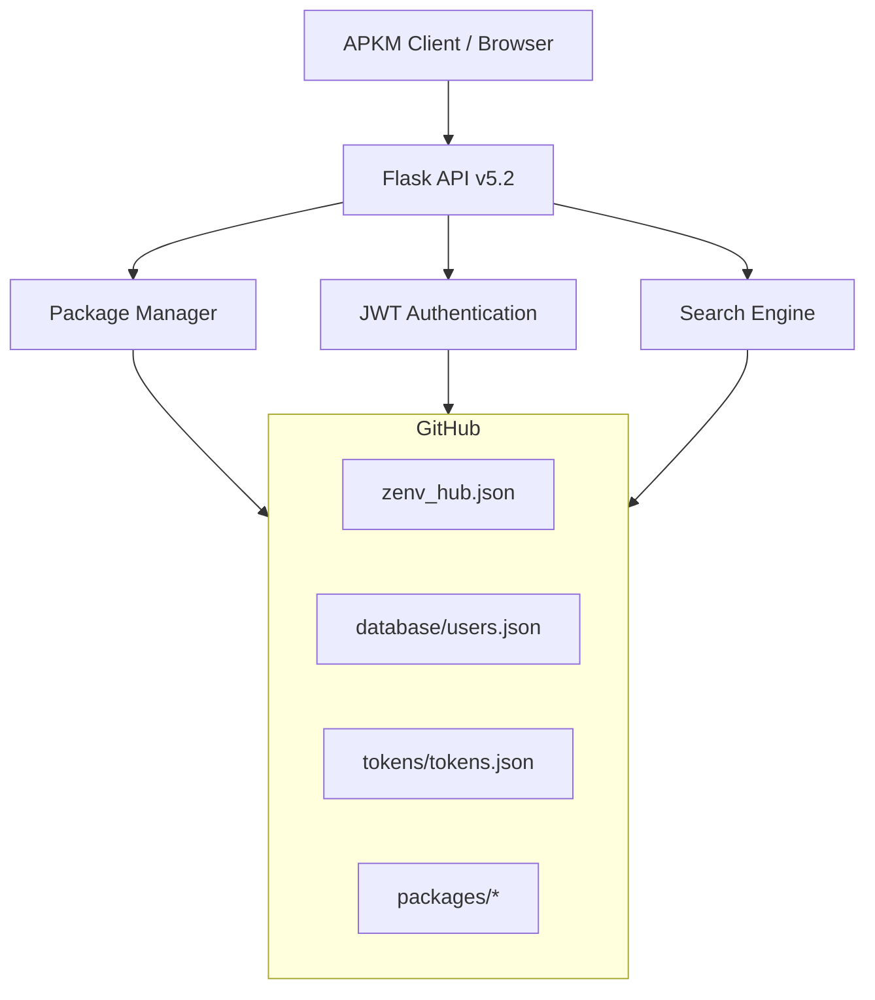

<div align="center">
  

  # 🚀 Zarch Hub
  
  ### The Ultimate APKM Package Registry
  
  [](https://discord.gg/W2xN49q9h)
  [](https://github.com/gopu-inc/gsql-badge)
  [](LICENSE)
  [](https://gsql-badge.onrender.com)
  [](https://gsql-badge.onrender.com)
  [](https://python.org)
  [](https://flask.palletsprojects.com)
</div>

---

## 📋 Table of Contents

- [✨ Overview](#-overview)
- [🌟 Key Features](#-key-features)
- [🏗️ Architecture](#️-architecture)
- [🚀 Quick Start](#-quick-start)
- [📡 API Reference](#-api-reference)
- [🔒 Security](#-security)
- [💻 Tech Stack](#-tech-stack)
- [📊 Live Demo](#-live-demo)
- [🤝 Community](#-community)
- [📄 License](#-license)

---

## ✨ Overview

**Zarch Hub** is a modern, secure, and production-ready package registry server built specifically for the **APKM (Alpine Package Manager)** ecosystem. It serves as the central repository for discovering, sharing, and managing Alpine Linux packages with enterprise-grade security and developer-friendly workflows.

> 🔗 **Live Demo:** [https://gsql-badge.onrender.com](https://gsql-badge.onrender.com)
> 
> 📦 **Client Tools:** [gopu-inc/apkm-gest](https://github.com/gopu-inc/apkm-gest)

---

## 🌟 Key Features

### 🔐 **Enterprise-Grade Security**
| Feature | Description |
|---------|-------------|
| **AES-256 Encryption** | All sensitive data encrypted with Fernet |
| **JWT Authentication** | Secure token-based authentication |
| **bcrypt Hashing** | Passwords securely hashed |
| **Rate Limiting** | 100 requests/minute per IP |
| **Security Headers** | CSP, HSTS, X-Frame-Options |
| **XSS Prevention** | Bleach HTML sanitization |

### 📦 **Package Management**
- Upload/download `.tar.bool` packages (up to 100MB)
- Automatic README.md extraction and Markdown rendering
- SHA256 checksum verification
- Version tracking and release management
- Public/private package scopes

### 🚀 **Developer Experience**
- RESTful API with versioning (`/v5.2/`)
- Comprehensive API documentation
- Real-time search with filters
- Web dashboard for package management
- Discord community integration

### 🌐 **GitHub Integration**
- All data stored in GitHub repositories
- No local database required
- Transparent and auditable storage
- Easy backup and migration

---

## 🏗️ Architecture


---

### 🚀 Quick Start

**Prerequisites**

```bash
# Requirements
- Python 3.11+
- GitHub account & personal access token
- Git
```

**Local Development**

```bash
# 1. Clone the repository
git clone https://github.com/gopu-inc/gsql-badge.git
cd gsql-badge

# 2. Install dependencies
pip install -r requirements.txt

# 3. Set up environment variables
cp .env.example .env
# Edit .env with your GitHub token

# 4. Run the server
python app.py
```

**Environment Variables**

```env
# GitHub Configuration
GITHUB_TOKEN=your_github_token_here
GITHUB_REPO=gopu-inc/gsql-badge
GITHUB_BRANCH=package-data

# Security
SESSION_TIMEOUT=3600        # 1 hour
TOKEN_EXPIRY=604800         # 7 days
MAX_CONTENT_LENGTH=104857600 # 100MB

# Cookies
COOKIE_SECURE=False         # Set to True in production
COOKIE_SAMESITE=Lax
```

**Docker Deployment**

```dockerfile
# Dockerfile
FROM python:3.11-slim

WORKDIR /app
COPY requirements.txt .
RUN pip install -r requirements.txt
COPY . .

CMD ["gunicorn", "app:app", "--bind", "0.0.0.0:10000"]
```

```bash
# Build and run
docker build -t zarch-hub .
docker run -p 10000:10000 --env-file .env zarch-hub
```

**Deploy on Render.com**

https://render.com/images/deploy-to-render-button.svg

**1. Fork the repository**
**2. Connect your GitHub account to Render**
**3. Create a new Web Service**
**4. Set environment variables**
**5. Deploy!**

---

**📡 API Reference**

All API endpoints are prefixed with /v5.2/

**🔐 Authentication Endpoints**

Method Endpoint Description
POST /auth/register Create a new account
POST /auth/login Authenticate and get token
GET /auth/verify Verify token validity

**Register**

```json
POST /v5.2/auth/register
{
  "username": "mauricio",
  "email": "mauricio@example.com",
  "password": "Test123!"
}
```

**Login**

```json
POST /v5.2/auth/login
{
  "username": "mauricio",
  "password": "Test123!"
}
```

### 📦 Package Endpoints

Method Endpoint Description
GET /package/search?q={query} Search packages
GET /package/{name} Get package details
POST /package/upload/{scope}/{name} Upload package (auth)
GET /package/download/{scope}/{name}/{version} Download package

**Search Packages**

```bash
curl https://gsql-badge.onrender.com/v5.2/package/search?q=apkm
```

**Get Package Info**

```bash
curl https://gsql-badge.onrender.com/v5.2/package/apkm
```

**Upload Package**

```bash
curl -X POST https://gsql-badge.onrender.com/v5.2/package/upload/public/apkm \
  -H "Authorization: Bearer YOUR_TOKEN" \
  -F "file=@apkm-v2.0.0.tar.bool" \
  -F "version=2.0.0" \
  -F "release=r1" \
  -F "arch=x86_64"
```

**Download Package**

```bash
curl -L -o apkm.tar.bool \
  https://gsql-badge.onrender.com/package/download/public/apkm/2.0.0
```

## 📊 Response Examples

**Success Response (200)**

```json
{
  "success": true,
  "token": "zarch_xxx...",
  "user": {
    "username": "mauricio",
    "role": "user",
    "created_at": "2026-03-07T12:00:00"
  }
}
```

**Package List (200)**

```json
{
  "results": [
    {
      "name": "apkm",
      "version": "2.0.0",
      "author": "mauricio",
      "downloads": 42,
      "scope": "public"
    }
  ]
}
```

**Error Response (4xx/5xx)**

```json
{
  "error": "Invalid credentials"
}
```

**⚠️ Error Codes**

Code Description
400 Bad Request - Missing or invalid fields
401 Unauthorized - Invalid or missing token
404 Not Found - Package/user not found
429 Too Many Requests - Rate limit exceeded
500 Internal Server Error

---

### 🔒 Security

**🔐 Security Features**

Feature Implementation
Encryption Fernet (AES-128) for cookies & sensitive data
Authentication JWT with bcrypt password hashing
Headers CSP, HSTS, X-Frame-Options, X-Content-Type-Options
Validation Pydantic models for all incoming data
Sanitization Bleach for HTML/Markdown cleaning
Rate Limiting 100 requests/minute per IP
Session Management HTTPOnly, Secure, SameSite cookies

**🔑 Token Security**

```python
# JWT Token Structure
{
  "username": "mauricio",
  "role": "user",
  "iat": 1741353600,
  "exp": 1741958400
}
```

### 🛡️ Security Headers

```http
Strict-Transport-Security: max-age=31536000; includeSubDomains
X-Content-Type-Options: nosniff
X-Frame-Options: DENY
X-XSS-Protection: 1; mode=block
Content-Security-Policy: default-src 'self' https:
```

---

### 💻 Tech Stack

Category Technology Version
Backend Framework Flask 3.0+
API REST + JSON v5.2
Authentication JWT + bcrypt -
Storage GitHub API -
Frontend HTML + Tailwind CSS 3.4+
Security Cryptography, Fernet, Bleach -
Validation Pydantic 2.0+
Markdown Python-Markdown 3.4+
Deployment Render / Docker -

---

### 📊 Live Demo

**🌐 Production Instance**

```
🔗 URL: https://gsql-badge.onrender.com
📡 API: https://gsql-badge.onrender.com/v5.2
📊 Status: ✅ Online
📦 Uptime: 99.9%
```

**🧪 Test Credentials**

```
👤 Username: mauricio
🔑 Password: Test123!
```

**📈 Current Stats**
```mairmed
https://img.shields.io/badge/Packages-50+-8B5CF6?style=flat-square
https://img.shields.io/badge/Downloads-1.2k+-10B981?style=flat-square
https://img.shields.io/badge/Contributors-5-3B82F6?style=flat-square
```
---

### 🤝 Community

**🌟 Join Our Discord!**

[discord](https://discordapp.com/api/guilds/123456789/widget.png?style=banner2)

<div align="center">
  <a href="https://discord.gg/W2xN49q9h">
    
  </a>
  <a href="https://github.com/gopu-inc/gsql-badge">
    
  </a>
  <a href="mailto:ceoseshell@gmail.com">
    
  </a>
</div>

### 📢 Stay Updated

**· Discord: Join our server for real-time updates**
**· GitHub: Watch the repo for releases**
**· Twitter: @zarchhub for announcements**

---

### 📄 License

<div align="center">
  
</div>

MIT License

Copyright (c) 2026 Gopu.inc

Permission is hereby granted, free of charge, to any person obtaining a copy
of this software and associated documentation files (the "Software"), to deal
in the Software without restriction, including without limitation the rights
to use, copy, modify, merge, publish, distribute, sublicense, and/or sell
copies of the Software, and to permit persons to whom the Software is
furnished to do so, subject to the following conditions:

The above copyright notice and this permission notice shall be included in all
copies or substantial portions of the Software.

**get**: [LICENSE]
```
```
---

<div align="center">
  
  
> Built with ❤️ for the APKM community

Website • Documentation • GitHub • Discord

<sub>© 2026 Zarch Hub. All rights reserved.</sub>

</div>
